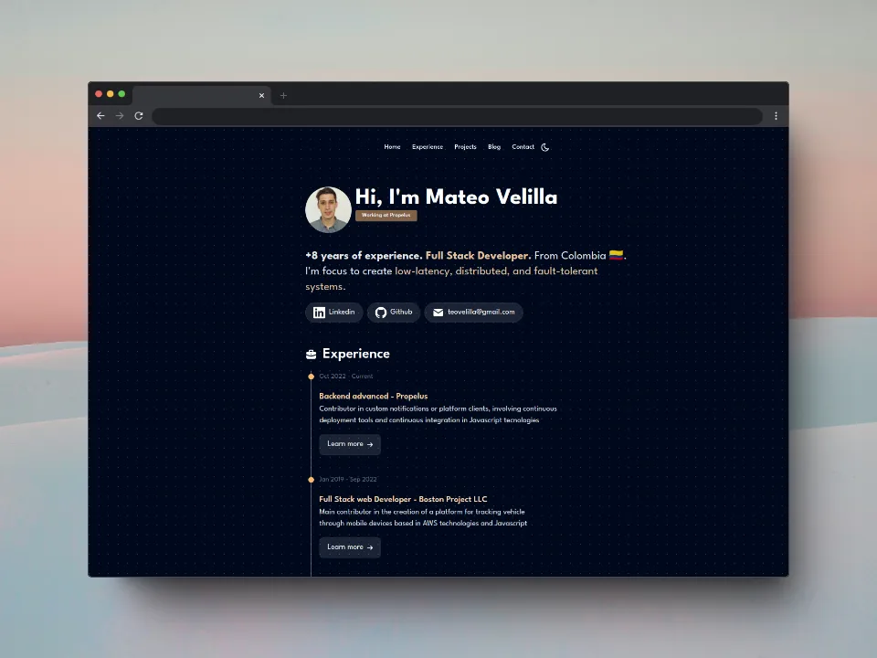

# Mateo velilla's Portfolio

>  **screenshot**

## 🧞 Commands

All commands are run from the root of the project, from a terminal:

| Command                   | Action                                           |
| :------------------------ | :----------------------------------------------- |
| `npm install`             | Installs dependencies                            |
| `npm run dev`             | Starts local dev server at `localhost:4321`      |
| `npm run build`           | Build your production site to `./dist/`          |
| `npm run preview`         | Preview your build locally, before deploying     |

## TOOLS AND LIBRARIES USED 
- https://bg.ibelick.com/
- https://fontsource.org/
- https://tailwindcss.com/
- https://tabler.io/icons
- https://svgl.app/
- https://flowbite.com/
- https://shots.so/
- https://squoosh.app/
---
## CONCEPTS
- https://developer.mozilla.org/en-US/docs/Web/CSS/gradient/radial-gradient
- https://developer.mozilla.org/en-US/docs/Web/CSS/scroll-behavior 
- https://developer.mozilla.org/en-US/docs/Web/CSS/animation-timeline
- https://developer.mozilla.org/en-US/docs/Web/CSS/@media/prefers-color-scheme
- https://developer.mozilla.org/en-US/docs/Web/CSS/@keyframes
- https://jsonresume.org/

## TODO
- backdrop-blur bg-white/20 but in dark mode

## Based on MiduDev [portfolio](https://porfolio.dev)